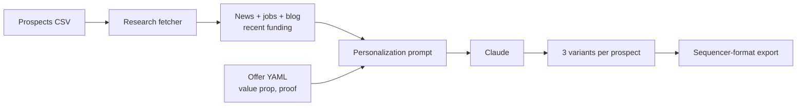

# personalized-outbound-engine

Generate genuinely personalized cold emails at scale. For each prospect, the engine pulls a small set of public research signals (recent blog posts, job openings, 10-K excerpts when public, recent funding news), feeds them to Claude with a strict template that requires a concrete reference, and produces three subject + body variants. Outputs are formatted for direct upload to Apollo, Smartlead, or Outreach.

## The GTM problem this solves

"Personalized at scale" is the most lied-about phrase in B2B sales. In practice it means a `{{first_name}}` token and a sentence that could apply to any company in the ICP. Real personalization — the kind that opens replies — requires a research step. This engine makes the research step a function call. Reps don't write per-prospect emails; they review and edit them.

## Quick start

```bash
pip install -r requirements.txt
export ANTHROPIC_API_KEY=sk-...
python -m outbound.cli generate \
  --prospects data/prospects.csv \
  --offer offers/series_b_devtools.yaml \
  --variants 3 \
  --out emails.csv
```

Sample output row:

```
prospect_email,variant,subject,body,reference,model
sara@notion.so,A,"Sales Engineer hire — a thought","Hi Sara — saw the SE opening you posted last week...","job_posting:Sales Engineer",claude-haiku-4-5
```

## Architecture



## Design choices

**Research is opt-in per source.** Calling out to ten APIs per prospect gets expensive fast. The fetcher reads a `sources:` list from the offer YAML and only calls those. Default is `[blog_rss, jobs_page, news]`, all of which are scrape-friendly.

**The prompt requires a concrete reference.** The system prompt forbids vague "loved your post about company culture" lines and requires a quoted phrase or a specific fact ("the SE role you posted last Tuesday"). The model declines to generate if research is empty rather than make something up.

**Three variants, not one.** A/B/C testing is built into the workflow because no single voice wins. The variants vary in tone (tight · conversational · question-led), not just wording.

**Mock mode for evaluators.** With no `ANTHROPIC_API_KEY` the engine generates deterministic stub emails so the pipeline runs end-to-end. Useful for CI and for someone reading the repo to evaluate the structure.

## Layout

```
src/outbound/
  research.py        Fetchers: blog RSS, jobs, news
  prompt.py          System prompt + variant style guide
  generate.py        Generation orchestrator
  exporters.py       Apollo / Smartlead / Outreach CSV formats
  cli.py
offers/
  series_b_devtools.yaml   Sample offer with proof points + sources
data/
  prospects.csv
```

MIT.
